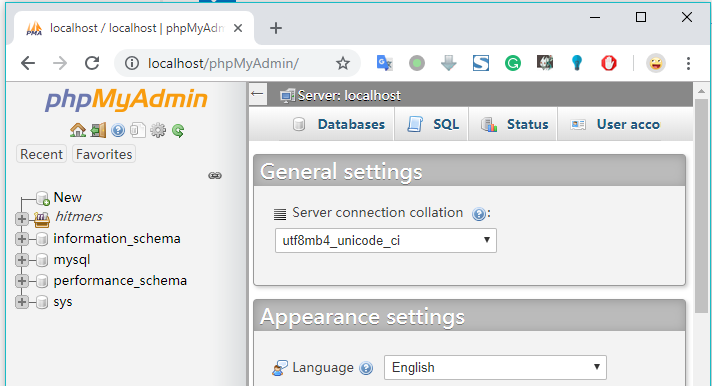
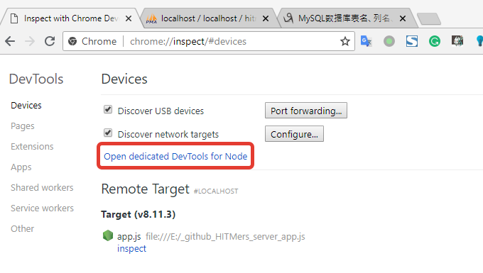

# HITMers Node.js server

<p align="center">
  <a href="https://travis-ci.com/upupming/HITMers-node-js-server/builds"></a>
  <a href="https://github.com/upupming/HITMers-node-js-server/blob/dev/LICENSE"></a>
  <a href="https://coveralls.io/github/upupming/HITMers-node-js-server?branch=dev"></a>
</p>

RESTful API for [HITMers Client](https://github.com/upupming/HITMers).

## Development environment

+ MySQL 8.0.12
+ Nginx 1.14.0
+ PHP 7.2.9
+ phpMyAdmin 4.8.2

[Here](./.notes/conf/) are My configuration files.

### Nginx, PHP and phpMyAdmin Installation

<details>

See [Nginx with PHP and MySQL on Windows 7](https://www.chanhvuong.com/2809/nginx-with-php-and-mysql-on-windows-7/) for more information.

You can use [`.bat` scripts](./.notes/scripts) for starting and stopping Nginx and PHP more efficiently.

[This](./.notes/conf/nginx.conf) is my `nginx.conf` for serving phpMyAdmin. Then put `phpMyAdmin` folder unzipped from [phpMyAdmin Download](https://www.phpmyadmin.net/downloads/) to `E:\software\nginx-1.14.0\html` folder, you will be able to access it at `http://localhost/phpMyAdmin`：



You can also install Adminer(similar to phpMyAdmin but for Postgers instead of MySQL) by just copying `adminer-x.x.x.php` to `html` folder. You will need it to access Heroku's Postgers database, see [Production environment](#production-environment) for more infromation.

</details>

### MySQL Installation

<details>

**Step 1: download**

Download ZIP Archive from https://dev.mysql.com/downloads/mysql/

**Step 2: configure**

Unzip and create `my.ini` in the root of folder:

```ini
[client]
port=3306
default-character-set = utf8
[mysql]
default-character-set = utf8
[mysqld]
port=3306

log_error = "mysql_error.log"
basedir="E:\\software\\mysql-8.0.12-winx64"

sql_mode=STRICT_TRANS_TABLES,NO_ZERO_DATE,NO_ZERO_IN_DATE,ERROR_FOR_DIVISION_BY_ZERO
datadir="E:\\software\\mysql-8.0.12-winx64\\data"
collation-server = utf8_unicode_ci
init-connect='SET NAMES utf8'
character-set-server = utf8
skip-character-set-client-handshake
# Ude this because `caching_sha2_password` is not supported in mysqljs yet
default_authentication_plugin = mysql_native_password
```

**Step 3: initialize**

Run following commands as administrator:

```bash
# Initialize database with root user and blank password
PS E:\software\mysql-8.0.12-winx64> .\bin\mysqld --initialize-insecure

# Install MySQL as a Windows service
PS E:\software\mysql-8.0.12-winx64> .\bin\mysqld --install-manual

# Start MySQL Server service
net start mysql

# Run MySQL Client
PS E:\software\mysql-8.0.12-winx64> .\bin\mysql.exe -u root

# The new `caching_sha2_password` is not supported by mysqljs yet, so we use old `mysql_native_password`
ALTER USER 'root'@'localhost' IDENTIFIED WITH mysql_native_password BY 'data4upupming!';
```

**Other Helpful commands:**

```bash
# Stop MySQL Server service
net stop mysql

# Uninstall MySQL Server service
sc delete mysql
```

</details>

### Chorme devtools for node process

<details>

Start node process using nodemon:

```bash
npm run dev
```

Open <a href="chrome://inspect/">chrome://inspect/</a>.

Use the "Open dedicated DevTools for Node" option for debugging node process. It will connect to node.js as soon as it starts or restarts, so there is no need to open it manually each time.



</details>

## Production environment

+ Heroku Node.js application
  - Heroku Postgres
  - Adminer 4.6.3

You can connect Heroku Postgers database with any [GUI tools](https://wiki.postgresql.org/wiki/Community_Guide_to_PostgreSQL_GUI_Tools) locally. For me, [Adminer](https://www.adminer.org/) is the fastest tool.

### Run the app locally

1. Add a `.env` file defining the same environment variables as the deployed app:

    ```env
    # Heroku Postgres database credentials
    database_url=postgres://...
    # Secret for signing authentication token
    secret=...
    ```

2. Stop the deployed app to free database connections(max is 20 for Heroku Postgres) for local process:

    ```bash
    heroku ps:scale web=0
    ```

3. Start the app locally

    ```bash
    heroku local web
    ```

## Useful links

1. https://www.chanhvuong.com/2809/nginx-with-php-and-mysql-on-windows-7/
2. https://www.digitalocean.com/community/tutorials/a-basic-mysql-tutorial
3. https://www.digitalocean.com/community/tutorials/how-to-create-a-new-user-and-grant-permissions-in-mysql 
4. https://stackoverflow.com/questions/49948350/phpmyadmin-on-mysql-8-0
5. https://stackoverflow.com/questions/50093144/mysql-8-0-client-does-not-support-authentication-protocol-requested-by-server/51918364#51918364
6. https://stackoverflow.com/questions/41398970/can-i-get-node-inspect-to-open-chrome-automatically
